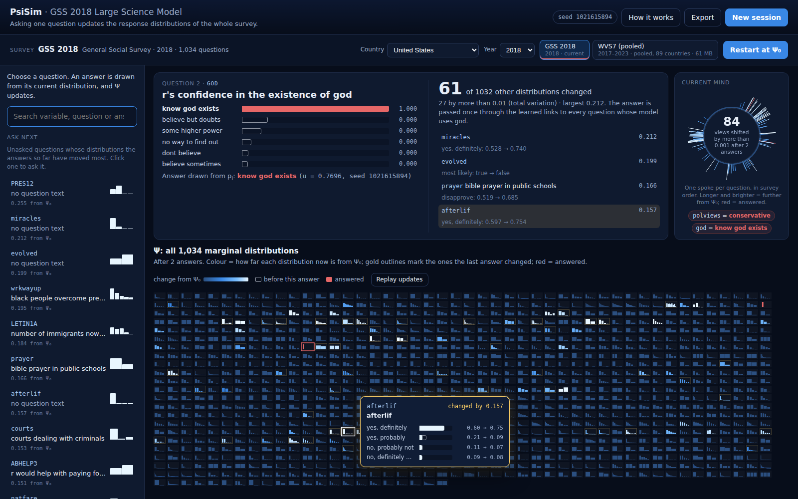

# PsiSim: what one survey answer does to a Large Science Model

PsiSim shows, interactively, that **asking a single survey question changes
the model's whole picture of the respondent**. A trained Large Science Model
(LSM) of a survey holds one response distribution for every question. Before
anything is asked, these are the distributions the model implies for an empty
survey. When one question is answered, that question's distribution collapses
to the answer, and the change is passed through the model's learned links to
every question that depends on it. The next question is asked in this updated
state.

The repository contains the webapp, the minimal native LSM runtime it needs
(vendored from `zeroknowledgediscovery/lsm`), and a small PsiSim-owned native
module for the update. Models come from the public DTAG model release: GSS by
year, Afrobarometer rounds, Eurobarometer waves and WVS7.



*GSS 2018 after two answers (`polviews` = conservative, then `god` = know god exists): the asked item collapses to the red answer, 61 other distributions change, and the largest updates pop out as before/after cards.*

## Quickstart

### Requirements

- Linux (tested on Ubuntu) or macOS (untested; needs `libomp` for OpenMP)
- a C++17 compiler with OpenMP, CMake ≥ 3.18 (Ninja optional), Python ≥ 3.9
  with development headers
- network access to GitHub (the first build fetches pybind11 and
  nlohmann/json) and to `storage.googleapis.com` (public model archives)

On Ubuntu/Debian:

```bash
sudo apt-get install -y g++ cmake ninja-build python3-dev python3-pip
```

### Run the interactive webapp (one command)

```bash
git clone https://github.com/zeroknowledgediscovery/psisim
cd psisim
bash scripts/run_webapp.sh
```

then open <http://127.0.0.1:8000/>. The script installs the Python
requirements, builds the native modules (a few minutes the first time; skipped
when they are up to date), downloads the GSS 2018 model once (~1 MB), and
starts the server. Options are passed through, e.g.
`bash scripts/run_webapp.sh --port 9000` or `--host 0.0.0.0` to open it to
other machines.

<details>
<summary>The same steps by hand</summary>

```bash
python3 -m pip install -r applications/psisimulation/requirements.txt -r webapp/requirements.txt
cmake -S . -B build -G Ninja -DCMAKE_BUILD_TYPE=Release
cmake --build build --target predict_distribution qdistance psisim_dynamics -j "$(nproc)"
python3 applications/psisimulation/fetch_model.py gss/gss_2018
python3 webapp/server.py --port 8000
```

</details>

### Use it

- **Choose a survey** in the bar under the header: a country and a year select
  the matching public DTAG model (GSS by year for the United States,
  Afrobarometer rounds, Eurobarometer waves, WVS7). **Load survey** downloads
  it on first use and starts at its empty state $\Psi_0$.
- **Ask a question**: click one in *Ask next*, search for one, or click any
  sparkline. An answer is drawn from the question's current distribution and
  that distribution collapses to a red bar.
- **Watch $\Psi$ update**: every distribution the answer changed morphs and
  glows in the grid of all marginals, the largest changes pop out as
  before/after cards, and the *Current mind* donut shows how far each item now
  is from $\Psi_0$. *Ask next* re-ranks the remaining questions.
- **New session** restarts at $\Psi_0$ (optionally with a fixed random seed);
  **Export** downloads a JSON record of the session.

Details: [`webapp/README.md`](webapp/README.md).

### Run the tests

```bash
python3 tests/test_model_cache.py              # seconds, no model needed
python3 tests/test_propagation_dynamics.py     # ~3 min, GSS 2018 model
cd webapp && python3 smoke_test.py             # webapp engine end to end
```

### Where things are

| document | contents |
| --- | --- |
| this README, sections 1–6 | the LSM background and the mathematics of one question |
| [`webapp/README.md`](webapp/README.md) | webapp: features, survey selection, configuration, deployment, HTTP API |
| [`webapp_instruction.md`](webapp_instruction.md) | original design specification of the webapp |
| [`applications/psisimulation/README.md`](applications/psisimulation/README.md) | the older command-line research tools (section 7) |
| [`webapp/assets/PROVENANCE.md`](webapp/assets/PROVENANCE.md) | survey catalog and item labels (built from DTAG) |
| [`LSM_PROVENANCE.md`](LSM_PROVENANCE.md) | vendored native runtime |

---

## 1. Background: the native Large Science Model

### 1.1 Model files

A native model is a directory

```text
<model>/
    trees/binary/tree_0.bin, tree_1.bin, ...   # one learned predictor per item
    source_maps/                               # raw answer labels <-> integer codes
```

The source maps translate each item's answer labels to the integer codes used
inside the trees; code $0$ is reserved for "missing". The item count, item
names and answer categories shown by the app come from these files. Models are
named by public keys such as `gss/gss_2018`, `afrobarometer/r7` or
`eurobarometer/ZA7575_v1-0-0`; `fetch_model.py` downloads them from the public
release, verifies their SHA256 and installs them under `~/.cache/dtag/models/`
(or the directory in `DTAG_MODEL_ROOT`).

### 1.2 One learned conditional per item

Let the survey items be $X_1,\ldots,X_d$ with finite answer alphabets
$\Sigma_i$. For each item the LSM contains a predictor

```math
\phi_i:\; x_{-i}\;\longmapsto\;\Pr_{\mathrm{LSM}}(X_i=\cdot\mid x_{-i}),
```

stored in `tree_i.bin`. Its input is a **hard partial row**: every other item
is either a concrete answer or missing. Its output is a distribution over
$\Sigma_i$. The predictors are learned separately from data; they are not
assumed to be the exact conditionals of one joint distribution, which is why
the update in section 3 is built to need no such assumption.

### 1.3 Tree inference

Each predictor is a categorical decision tree. An internal node splits on an
item $X_c$ with answer subsets $A_L$ and $A_R$. For an input row $x$:

- if $x_c$ is given and lies in $A_L$ (or $A_R$), inference follows the left
  (or right) child;
- if $x_c$ is missing, or its answer is in neither subset, inference evaluates
  **both** children and mixes them by the learned subtree masses $N_L,N_R$:

```math
p=\pi_L\,p_L+(1-\pi_L)\,p_R,\qquad \pi_L=\frac{N_L}{N_L+N_R};
```

- at a leaf, the stored target counts are normalised.

### 1.4 Learned dependencies

The tree for item $j$ splits on a specific set of other items. We write
$i\to j$ when the tree for $j$ actually uses item $i$. An answer to $i$ can
change $p_j$ directly only if $i\to j$. On GSS 2018 (1,034 items) there are
23,508 such links.

### 1.5 Soft evidence

The native runtime can also route a *distribution* $q$ over the answers of
one item through a tree: at a split on that item each answer's mass follows
its branch (mass on answers the split does not resolve is divided by the same
subtree masses), and the distribution is conditioned on the branch so that a
later split on the same item stays consistent. For a row in which only item
$i$ carries $q$ and every other item is missing, this computes exactly

```math
\sum_{s\in\Sigma_i} q(s)\,\phi_j\bigl(x^{(i=s)}\bigr)
```

in one pass through the tree (section 3.5).

---

## 2. The state $\Psi$ and the empty state $\Psi_0$

The state is one distribution per item,

```math
\Psi=(p_1,\ldots,p_d)\in\prod_{i=1}^d\Delta(\Sigma_i),
```

not one answer per item. The app starts every survey at the **empty state**:
with the all-missing row $x_\varnothing=(\varnothing,\ldots,\varnothing)$,

```math
p_i^0=\phi_i(x_\varnothing),\qquad \Psi_0=(p_1^0,\ldots,p_d^0).
```

$\Psi_0$ is not a uniform prior: it is what the trained model implies when
nothing is known about the respondent. For surveys that pool many countries
(Afrobarometer, Eurobarometer, WVS7), $\Psi_0$ is the pooled empty state; the
country is one of the survey's own items.

$\Psi_0$ **does not move until a question is asked**: nothing in the app
changes $\Psi$ except an answer. $\Psi_0$ depends only on the model files and
the native runtime, so it is computed once and kept in a persistent cache
(directory `PSISIM_CACHE_DIR`, default `~/.cache/psisim`), keyed by a fingerprint of
both; cached values are bit-identical to freshly computed ones.

---

## 3. Asking a question: one update of $\Psi$

### 3.1 Drawing the answer

The answer to item $i$ is drawn from its **current** distribution,

```math
\sigma\sim p_i,
```

using the session's seeded random generator: one uniform draw $u$ selects the
answer whose cumulative probability first exceeds $u$. The seed and $u$ are
shown and exported, so a session can be replayed exactly.

### 3.2 How one answer affects one dependent item

For each item $j$ with $i\to j$, the model's response to item $i$ alone is

```math
K_{j\leftarrow i}(\cdot\mid s)=\phi_j\bigl(x^{(i=s)}\bigr),\qquad
x^{(i=s)}_k=\begin{cases}s,&k=i\\ \varnothing,&k\neq i,\end{cases}
```

the prediction for $j$ when only $X_i=s$ is known (section 1.3).

### 3.3 The centred update

The answer replaces $p_i$ by the point mass $\delta_\sigma$, a change of

```math
\Delta_i=\delta_\sigma-p_i .
```

Only this change is passed on. Every dependent item $j$ receives

```math
r_j=\sum_{s\in\Sigma_i}\Delta_i(s)\,K_{j\leftarrow i}(\cdot\mid s)
=K_{j\leftarrow i}(\cdot\mid\sigma)-\sum_{s}p_i(s)\,K_{j\leftarrow i}(\cdot\mid s),
```

and its new distribution is

```math
p_j^{+}=\Pi_{\Delta(\Sigma_j)}\bigl[p_j+r_j\bigr],\qquad p_i^{+}=\delta_\sigma ,
```

where $\Pi_{\Delta}$ is the Euclidean projection onto the probability simplex
(needed only when $p_j+r_j$ has a negative entry). Items with no link from
$i$ are unchanged.

Why the change is centred: since the learned predictors are not the
conditionals of one joint law, $\sum_s p_i(s)K_{j\leftarrow i}(\cdot\mid s)$
need not equal $p_j$. Propagating only the change $\Delta_i$ guarantees that
an answer equal to the current belief ($\Delta_i=0$) moves nothing, and that
the update never relies on an identity the trained model does not satisfy.

### 3.4 Clamping

After the update, item $i$ is **clamped**: it stays at $\delta_\sigma$, cannot
be asked again, and is never modified by later answers.

### 3.5 Items with many answers

Some items have hundreds of answer categories (Afrobarometer party or language
lists). Writing $\Delta_i=m_+q_+-m_-q_-$ with probability distributions
$q_\pm$, the response $r_j$ is evaluated as $m_+\,\Phi_j(q_+)-m_-\,\Phi_j(q_-)$,
where $\Phi_j(q)$ is the soft-evidence pass of section 1.5. This equals the
sum over categories up to floating-point rounding (tested to $10^{-12}$) and
needs two tree passes instead of one per category: a 299-category item takes
0.7 s instead of 75 s. Changes with at most 12 categories are summed directly.

### 3.6 A sequence of questions

Questions compose: $\Psi_0\to\Psi_1\to\Psi_2\to\cdots$, each answer drawn from
and applied to the current state. Because each answer changes the
distributions later answers are drawn from, the trajectory depends on which
questions are asked and in what order.

---

## 4. What the app shows

All changes are measured by total variation,
$\mathrm{TV}(p,q)=\tfrac12\sum_s|p(s)-q(s)|$, computed on the distributions as
the browser receives them (rounded to $10^{-6}$; "changed" means
$\mathrm{TV}>1.25\cdot10^{-6}$).

| element | quantity |
| --- | --- |
| question panel | $p_i$ before the answer, the draw, and its collapse to $\delta_\sigma$ (red) |
| summary | number of items $j\neq i$ with $\mathrm{TV}(p_j^{+},p_j)>1.25\cdot10^{-6}$; how many exceed $0.01$; the largest |
| grid of sparklines | every $p_j$; colour = $\mathrm{TV}(p_j,p_j^0)$ on a log scale (red = answered) |
| pop-out cards | the largest updates of the last answer: $p_j$ before (outline) and after (fill) |
| current mind | one spoke per item; length and colour = $\mathrm{TV}(p_j,p_j^0)$ |
| ask next | unasked items ranked by $\mathrm{TV}(p_j,p_j^0)$ |

---

## 5. Implementation

| step | where |
| --- | --- |
| model download and verification | `applications/psisimulation/fetch_model.py` |
| $\Psi_0$ and its cache | `applications/psisimulation/common.py` (`psi0`, `psi0_cached`) |
| learned links, the update (3.2–3.5), clamping | `bindings/psisim_dynamics_py.cpp` (`used_columns`, `PropagationPsiState.hard_observe`) |
| tree inference, soft evidence | vendored runtime, `src/PredictDistribution/` |
| sessions, answer draw, statistics | `webapp/engine.py` |
| HTTP API | `webapp/server.py` |
| survey catalog and item labels | `webapp/build_catalog.py` → `webapp/assets/` |
| browser | `webapp/static/` (draws snapshots only; computes no model quantities) |

`PropagationPsiState.hard_observe` is checked bit-for-bit against the vendored
`CenteredLdpPsiState.hard_observe` in `tests/test_propagation_dynamics.py`,
which also checks that $\Psi_0$ does not move without an answer, that
answered items stay clamped, and the many-category evaluation of 3.5.

```text
webapp/                  the app (README: features, survey selection, configuration, API)
bindings/
    psisim_dynamics_py.cpp   PsiSim-owned: learned links + the update
    predict_distribution_py.cpp, qdistance_py.cpp   vendored LSM bindings
src/, include/           vendored native LSM runtime
applications/psisimulation/   model download, Psi0 helpers, command-line tools (section 7)
tests/                   regression tests
scripts/run_webapp.sh    one-command start
scripts/sync_lsm_runtime.sh   refresh the vendored runtime
```

The vendored runtime is synchronised from `zeroknowledgediscovery/lsm:dev-static`
by `.github/workflows/sync-lsm-bindings.yml` (needs the `LSM_SYNC_TOKEN`
secret); commits are recorded in `LSM_RUNTIME_SOURCE_COMMIT` and
`LSM_PROVENANCE.md`. The sync never touches PsiSim-owned files.

---

## 6. Interpretation boundaries

- The links are learned statistical dependencies between survey responses,
  not causal effects.
- One update shows the model's immediate response to one answer through its
  learned conditionals. It is a property of the trained model, not a claim
  about how a person's opinions change.
- Pooled multi-country models start from a pooled empty state, not from a
  specific country's.
- Item labels come from DTAG's semantic maps; items without one show their
  variable name.

---

## 7. Command-line research tools

`applications/psisimulation/` also contains the original command-line tools
(progressive and empty-state simulations, equilibrium clustering). They study
a different question: relaxation of $\Psi$ under repeated finite-$n$
empirical events, a finite-sample / large-deviation experiment that also moves
$\Psi_0$ without any answer. Their mathematics and usage are documented in
[`applications/psisimulation/README.md`](applications/psisimulation/README.md)
and its [worked example](applications/psisimulation/examples/README.md); the
webapp does not use them.
